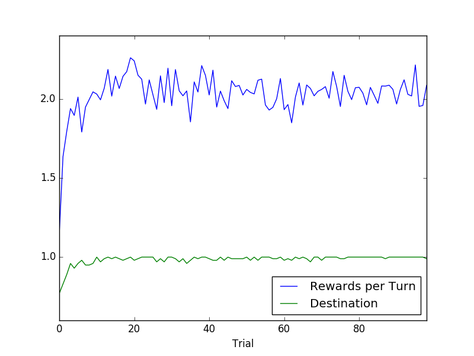

Kevin Palm
Udacity Machine Learning Nanodegree - Project 4
8/2016

**QUESTION 1**: Observe what you see with the agent's behavior as it
takes random actions. Does the smartcab eventually make it to the
destination? Are there any other interesting observations to note?

**ANSWER 1**: When the agent is taking random actions, I notice that the
rewards are mostly negative. It looks like the agent runs a lot of red
lights, cuts other drivers off, ect. While I was watching the agent
never arrived at a target destination, but taking random actions could
theoretically get the agent there. There would just be a lot of luck
involved. I also notice that when the agent goes off the side of the
map, it appears on the opposite side - so this grid is actually a
flattened sphere.

**QUESTION 2**: What states have you identified that are appropriate for
modeling the smartcab and environment? Why do you believe each of these
states to be appropriate for this problem?

**ANSWER 2**: I've defined the state as a list: the light color, if
there is any traffic surrounding the car, and which direction the
planner is directing the agent.

My logic for including all of these components in state are:

* Light color - important for yielding
* oncoming front - also important for yielding
* oncoming left - yielding again
* oncoming right - yielding
* planner direction - important for getting to (or avoiding) the target

**OPTIONAL**: How many states in total exist for the smartcab in this
environment? Does this number seem reasonable given that the goal of
Q-Learning is to learn and make informed decisions about each state? Why
or why not?

**OPTIONAL ANSWER**: There are 48 unique states possible given my
definition of state, which seems reasonable for the problem and the
amount of trials during which the agent gets to learn.

**QUESTION 3**: What changes do you notice in the agent's behavior when
compared to the basic driving agent when random actions were always
taken? Why is this behavior occurring?

**ANSWER 3**: The agent does start to seek out the target destinations.
It also stops running red lights, and cutting off other drivers. This is
occurring because that each action and reward are now being used to
update the agent's policy concerning that state, so when the agent finds
itself in the same or similar state again it can use the updated
policies to pick the next action, rather than a random choice. The
overall effect is that there's a lot less negative rewards getting
incurred constantly, and the smartcab does start seeking out the
destination.

**QUESTION 4**: Report the different values for the parameters tuned in
your basic implementation of Q-Learning. For which set of parameters
does the agent perform best? How well does the final driving agent
perform?

**ANSWER 4**: Here's a table of the parameters I tried and their
performances on the last ten rounds (average of 10 runs).

| Epsilon | Alpha | Gamma | Rewards per Turn | Destinations Reached |
|---------|-------|-------|------------------|----------------------|
| 0.2     | 0.2   | 0.3   | 2.207367602      | 1                    |
| 0.1     | 0.2   | 0.1   | 2.079277851      | 1                    |
| 0.1     | 0.2   | 0.3   | 2.07014653       | 1                    |
| 0.3     | 0.2   | 0.1   | 2.033722557      | 1                    |
| 0.3     | 0.1   | 0.1   | 2.029828885      | 1                    |
| 0.1     | 0.3   | 0.1   | 2.000196694      | 1                    |
| 0.1     | 0.1   | 0.1   | 1.967406606      | 1                    |
| 0.2     | 0.1   | 0.1   | 1.965554752      | 1                    |
| 0.3     | 0.3   | 0.1   | 1.962549466      | 1                    |
| 0.3     | 0.1   | 0.3   | 2.15948319       | 0.988888889          |
| 0.2     | 0.3   | 0.3   | 2.152544754      | 0.988888889          |
| 0.3     | 0.2   | 0.3   | 2.093428896      | 0.988888889          |
| 0.2     | 0.3   | 0.1   | 1.862837965      | 0.988888889          |
| 0.3     | 0.3   | 0.3   | 1.85189416       | 0.988888889          |
| 0.1     | 0.3   | 0.3   | 2.176400109      | 0.977777778          |
| 0.2     | 0.2   | 0.1   | 2.033498415      | 0.977777778          |
| 0.3     | 0.1   | 0.5   | 2.310587802      | 0.966666667          |
| 0.2     | 0.1   | 0.3   | 2.043346077      | 0.966666667          |
| 0.2     | 0.2   | 0.5   | 2.446405432      | 0.955555556          |
| 0.1     | 0.1   | 0.5   | 2.434614228      | 0.955555556          |
| 0.3     | 0.2   | 0.5   | 2.244029687      | 0.955555556          |
| 0.2     | 0.1   | 0.5   | 2.193300533      | 0.955555556          |
| 0.2     | 0.3   | 0.5   | 2.179456248      | 0.955555556          |
| 0.1     | 0.1   | 0.3   | 2.069022578      | 0.955555556          |
| 0.1     | 0.2   | 0.5   | 2.265488468      | 0.933333333          |
| 0.3     | 0.3   | 0.5   | 2.139192292      | 0.922222222          |
| 0.1     | 0.3   | 0.5   | 2.400442506      | 0.911111111          |

Using this table I selected the top combination which maximized
destinations reached, and then maximized rewards per turn. The
combination was epsilon=0.2, alpha=0.2, and gamma=0.3.

**QUESTION 5**: Does your agent get close to finding an optimal policy,
i.e. reach the destination in the minimum possible time, and not incur
any penalties? How would you describe an optimal policy for this
problem?

**ANSWER 5**: Running the experiment 100 consecutive times and averaging
together the trials showed that my selected tuning was closer to scores
of "Average Rewards per Turn for the last 10 trials: 2.12221825215" and
"Average Destinations Reached for the last 10 trials: 0.985555555556".
On a whim, I decided to try one other tuning, epsilon=0.2, alpha=0.2,
and gamma=0.2, which resulted in "Average Rewards per Turn for the last
10 trials: 2.03261044849" and "Average Destinations Reached for the last
10 trials: 0.995555555556". So I ended up selecting epsilon=0.2,
alpha=0.2, and gamma=0.2 as my final model. The graph below shows a
summary of those 100 runs.

My agent is currently getting close to a perfect 1.0 for its average
destinations reached, but browsing through the logs shows that it does
occasionally take illegal actions in its final 10 trials. From my most
recent run there were two moves that incurred negative rewards:

Trial 91, inputs = {'light': 'red', 'oncoming': None, 'right': None, 'left': 'forward'}, action = forward, reward = -1.0

Trial 96, inputs = {'light': 'green', 'oncoming': None, 'right': 'forward', 'left': None}, action = forward, reward = -0.5

My thinking is that these states are either encountered too rarely (but
considering my now reduced state space, I think this is unlikely. My
estimation is that the average run has 1300 moves, which should be
enough for a state space of 48.) or the forecasting component of the Q
equation is causing it. So I'm expecting that the car is learning to
take illegal moves anytime a reached destination inflates a specific
state outside of it's otherwise correct policy. I think the solution to
this would be to introduce a decay on the alpha, same as what I've
already now implimented on the epsilon.

An optimal policy for this problem would have a perfect destination
count of 1 , and it would never incur any
negative rewards. My learner isn't quite there yet, but it's pretty
close.
